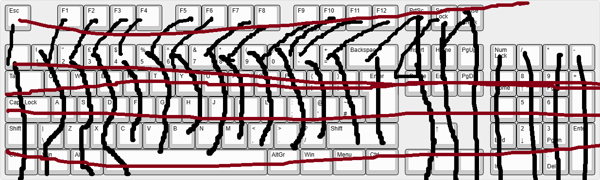
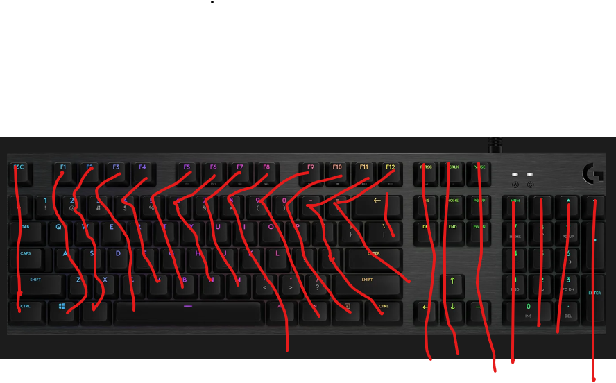

# kiboboard
custom-made keyboard

---
title: "Kibokeyboard"
author: Kibo no shirei-kan
description: A custom made fast full with underglow and Per keylighting 100% keybaord

created_at: "2025-7-26"

---

```July 26: Started the project 
I finally got my account verfied
and after some reaserch i realised that i need several componets 
Keyboard switches
Sk6812 MINI-E for the keybaord lighting and maybe some ligthing stirps for the underglow
PCB
the microcontroler the one sending infomation to the computer
Diodes to have a Nkeyrollover keyboard
case
Plate for the keycapps
stabilisiseds this is needed for the bigger keys like the space bar
and the firmware needs to be coded up! 
my Personal challange is to do this in a day!.


Current Parts list 
Cherry MX2A Red
SK6812 MINI-E
PCB - to be designed 
```
Same day calculated the amount of GPIO NEEDED for a iso 105 keyboard its 27 


6 hours

-------
27/7/2025
decided that that was the wrong layout

but instead without any home or the function cluster

---------
needed GPIO
27 GPIO for keys 
1 GPIO Per key RBG 
1 UNDERGLOW
9 rotary encoders(3)(this repaced the function key clusters)
TFT SCRENN  1 3(cs,dc,reset)+ shared SPI TFT SCREEN 2 3 (CS,DC,RESET) 
usb/misc1-2 

= **54 total GPIOs**
---------
MOB 
STM32F407VET6 (CONTROLLER)
SK6812 MINI-E (LIGHTS)
Cable Labs Artisanal Aviator Cable – Cyber Purple
Cherry MX2A Red Switches
ILI9341 320x240 TFT
0.91 Oled I2C Iic Module Lcd Display Screen Ssd1306 Chip
3 knobs with press


